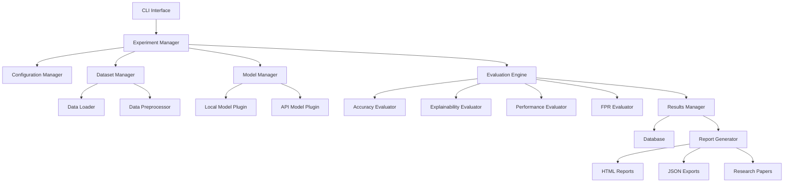
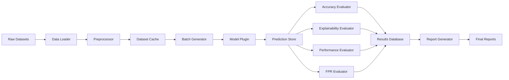

# Architectural Decisions for LLM Cybersecurity Benchmarking System

## Document Overview

**Project**: LLM Cybersecurity Attack Detection Benchmarking System
**Target Platform**: MacBook Pro M4 Pro with macOS
**Primary Use Case**: Academic research and model evaluation
**Last Updated**: January 2025

## Table of Contents

1. [System Overview](#1-system-overview)
2. [Core Architectural Decisions](#2-core-architectural-decisions)
3. [Technology Stack](#3-technology-stack)
4. [System Architecture](#4-system-architecture)
5. [Data Architecture](#5-data-architecture)
6. [Model Evaluation Pipeline](#6-model-evaluation-pipeline)
7. [API Design](#7-api-design)
8. [File Organization](#8-file-organization)
9. [Configuration Management](#9-configuration-management)
10. [Development Workflow](#10-development-workflow)

---

## 1. System Overview

### 1.1 Mission Statement
Build a comprehensive, automated benchmarking system to evaluate Large Language Models on cybersecurity attack detection tasks using public datasets, automated evaluation metrics, and consumer-grade hardware.

### 1.2 Key Design Principles
- **Modularity**: Each component should be independent and replaceable
- **Reproducibility**: All experiments must be fully reproducible
- **Scalability**: Architecture should handle both small experiments and large evaluations
- **Maintainability**: Code should be clean, documented, and testable
- **Hardware Efficiency**: Optimized for Apple Silicon M4 Pro limitations

### 1.3 Success Criteria
- Process 100K+ cybersecurity samples efficiently
- Evaluate 5-10 different LLM models
- Generate comprehensive benchmark reports
- Complete full evaluation cycle in <24 hours
- Maintain <500MB memory overhead (excluding models)

---

## 2. Core Architectural Decisions

### Decision 1: Modular Plugin Architecture

**Status**: ACCEPTED
**Context**: Need to support multiple model types, datasets, and evaluation metrics
**Decision**: Use plugin-based architecture with standardized interfaces
**Rationale**:
- Easy to add new models without changing core system
- Different evaluation metrics can be added independently
- Facilitates testing and maintenance
- Allows parallel development of components

```python
# Example plugin interface
class ModelPlugin:
    def load_model(self, config: ModelConfig) -> Model:
        pass

    def predict(self, input_data: List[str]) -> List[Prediction]:
        pass

    def get_explanation(self, input_data: str) -> str:
        pass
```

### Decision 2: Local-First with API Fallback

**Status**: ACCEPTED
**Context**: M4 Pro has limited resources but we need to test various model sizes
**Decision**: Prioritize local models (MLX) with API fallback for large models
**Rationale**:
- Cost control for large model evaluation
- Privacy for sensitive datasets
- Reduced latency for local models
- Flexibility to compare local vs. cloud performance

### Decision 3: SQLite for Data Storage

**Status**: ACCEPTED
**Context**: Need structured storage for results, metadata, and configurations
**Decision**: Use SQLite as primary database with JSON for complex objects
**Rationale**:
- No external dependencies or server setup
- ACID compliance for reliable results storage
- Excellent Python integration
- Portable database files for sharing results
- Sufficient performance for research workloads

### Decision 4: Configuration-Driven Evaluation

**Status**: ACCEPTED
**Context**: Need flexible experiment configuration and reproducibility
**Decision**: YAML-based configuration with Pydantic validation
**Rationale**:
- Human-readable experiment definitions
- Type safety and validation
- Version controllable configurations
- Easy parameter sweeps and ablation studies

### Decision 5: Async Processing Pipeline

**Status**: ACCEPTED
**Context**: Model inference can be I/O bound, especially for API calls
**Decision**: Use asyncio for concurrent model evaluation
**Rationale**:
- Better resource utilization
- Faster evaluation of multiple models
- Natural fit for API-based model calls
- Improved user experience with progress tracking

---

## 3. Technology Stack

### 3.1 Core Runtime

| Component | Technology | Version | Rationale |
|-----------|------------|---------|-----------|
| **Language** | Python | 3.11+ | Best ML ecosystem, MLX support |
| **Package Manager** | Poetry | 1.7+ | Dependency resolution, virtual env management |
| **Async Framework** | asyncio | Built-in | Native Python concurrency |
| **Configuration** | Pydantic | 2.5+ | Type safety, validation, serialization |

### 3.2 Machine Learning Stack

| Component | Technology | Version | Rationale |
|-----------|------------|---------|-----------|
| **Apple Silicon ML** | MLX | 0.15+ | Apple Silicon optimization |
| **Model Interface** | Transformers | 4.36+ | Standard model loading interface |
| **Local LLM Server** | Ollama | Latest | Easy local model management |
| **Evaluation** | scikit-learn | 1.4+ | Standard metrics and evaluation |
| **Numerical** | NumPy | 1.24+ | Numerical computations |

### 3.3 Data and Storage

| Component | Technology | Version | Rationale |
|-----------|------------|---------|-----------|
| **Database** | SQLite | 3.40+ | Embedded, zero-config database |
| **ORM** | SQLAlchemy | 2.0+ | Database abstraction and migrations |
| **Data Processing** | Pandas | 2.1+ | Data manipulation and analysis |
| **Dataset Loading** | Datasets | 2.16+ | HuggingFace dataset integration |

### 3.4 Development and Testing

| Component | Technology | Version | Rationale |
|-----------|------------|---------|-----------|
| **Testing** | pytest | 7.4+ | Comprehensive testing framework |
| **Code Quality** | ruff | 0.1+ | Fast Python linting and formatting |
| **Type Checking** | mypy | 1.8+ | Static type analysis |
| **Documentation** | mkdocs | 1.5+ | Documentation generation |

### 3.5 Visualization and Reporting

| Component | Technology | Version | Rationale |
|-----------|------------|---------|-----------|
| **Plotting** | matplotlib | 3.8+ | Scientific plotting |
| **Statistical Viz** | seaborn | 0.13+ | Statistical visualization |
| **Interactive** | plotly | 5.17+ | Interactive charts for reports |
| **Tables** | rich | 13.7+ | Beautiful CLI output |

---

## 4. System Architecture

### 4.1 High-Level Architecture



### 4.2 Component Responsibilities

#### 4.2.1 Core Components

**Experiment Manager**
- Orchestrates entire evaluation pipeline
- Manages experiment lifecycle and state
- Coordinates between all subsystems
- Handles error recovery and retries

**Configuration Manager**
- Loads and validates YAML configurations
- Manages environment variables and secrets
- Provides type-safe configuration objects
- Supports configuration inheritance and overrides

**Dataset Manager**
- Loads datasets from various sources (local, Kaggle, HuggingFace)
- Handles data preprocessing and normalization
- Manages train/test splits and cross-validation
- Caches processed datasets for performance

**Model Manager**
- Discovers and loads model plugins
- Manages model lifecycles and resources
- Provides unified interface across model types
- Handles model caching and optimization

#### 4.2.2 Evaluation Components

**Evaluation Engine**
- Coordinates evaluation across multiple metrics
- Manages parallel evaluation execution
- Aggregates results from different evaluators
- Handles progress tracking and logging

**Metric Evaluators**
- **Accuracy Evaluator**: Precision, recall, F1, AUC-ROC
- **Explainability Evaluator**: LLM-as-judge, BLEU, BERTScore
- **Performance Evaluator**: Latency, throughput, resource usage
- **FPR Evaluator**: False positive analysis and cost modeling

#### 4.2.3 Support Components

**Results Manager**
- Persists evaluation results to database
- Manages result versioning and metadata
- Provides query interface for analysis
- Handles result export and sharing

**Report Generator**
- Creates comprehensive benchmark reports
- Generates visualizations and comparisons
- Exports in multiple formats (HTML, PDF, JSON)
- Supports custom report templates

### 4.3 Plugin Architecture

```python
# Core plugin interface
from abc import ABC, abstractmethod
from typing import List, Dict, Any

class ModelPlugin(ABC):
    """Base interface for all model plugins"""

    @abstractmethod
    def initialize(self, config: Dict[str, Any]) -> None:
        """Initialize the model with configuration"""
        pass

    @abstractmethod
    async def predict(self, samples: List[str]) -> List[Dict[str, Any]]:
        """Generate predictions for input samples"""
        pass

    @abstractmethod
    async def explain(self, sample: str) -> str:
        """Generate explanation for a single sample"""
        pass

    @abstractmethod
    def cleanup(self) -> None:
        """Clean up resources"""
        pass

class DatasetPlugin(ABC):
    """Base interface for dataset plugins"""

    @abstractmethod
    def load(self, config: Dict[str, Any]) -> Dict[str, Any]:
        """Load and return dataset"""
        pass

    @abstractmethod
    def preprocess(self, data: Dict[str, Any]) -> Dict[str, Any]:
        """Preprocess the dataset"""
        pass

class EvaluatorPlugin(ABC):
    """Base interface for evaluator plugins"""

    @abstractmethod
    async def evaluate(self, predictions: List[Dict], ground_truth: List[Dict]) -> Dict[str, float]:
        """Evaluate predictions against ground truth"""
        pass
```

---

## 5. Data Architecture

### 5.1 Database Schema

```sql
-- Core tables for benchmark results
CREATE TABLE experiments (
    id TEXT PRIMARY KEY,
    name TEXT NOT NULL,
    description TEXT,
    config_hash TEXT NOT NULL,
    created_at TIMESTAMP DEFAULT CURRENT_TIMESTAMP,
    completed_at TIMESTAMP,
    status TEXT CHECK(status IN ('running', 'completed', 'failed', 'cancelled'))
);

CREATE TABLE datasets (
    id TEXT PRIMARY KEY,
    name TEXT NOT NULL,
    source TEXT NOT NULL,  -- 'kaggle', 'huggingface', 'local', etc.
    version TEXT,
    samples_count INTEGER,
    created_at TIMESTAMP DEFAULT CURRENT_TIMESTAMP,
    metadata JSON
);

CREATE TABLE models (
    id TEXT PRIMARY KEY,
    name TEXT NOT NULL,
    type TEXT NOT NULL,  -- 'local_mlx', 'api_openai', 'huggingface', etc.
    version TEXT,
    parameters_count BIGINT,
    created_at TIMESTAMP DEFAULT CURRENT_TIMESTAMP,
    config JSON
);

CREATE TABLE evaluations (
    id TEXT PRIMARY KEY,
    experiment_id TEXT REFERENCES experiments(id),
    model_id TEXT REFERENCES models(id),
    dataset_id TEXT REFERENCES datasets(id),
    started_at TIMESTAMP DEFAULT CURRENT_TIMESTAMP,
    completed_at TIMESTAMP,
    status TEXT CHECK(status IN ('running', 'completed', 'failed')),
    error_message TEXT
);

CREATE TABLE evaluation_results (
    id TEXT PRIMARY KEY,
    evaluation_id TEXT REFERENCES evaluations(id),
    metric_type TEXT NOT NULL,  -- 'accuracy', 'explainability', 'performance', 'fpr'
    metric_name TEXT NOT NULL,  -- 'precision', 'recall', 'bleu', 'latency', etc.
    value REAL NOT NULL,
    metadata JSON,
    created_at TIMESTAMP DEFAULT CURRENT_TIMESTAMP
);

CREATE TABLE predictions (
    id TEXT PRIMARY KEY,
    evaluation_id TEXT REFERENCES evaluations(id),
    sample_id TEXT NOT NULL,
    input_text TEXT NOT NULL,
    prediction TEXT NOT NULL,
    confidence REAL,
    explanation TEXT,
    ground_truth TEXT,
    processing_time_ms INTEGER,
    created_at TIMESTAMP DEFAULT CURRENT_TIMESTAMP
);

-- Indexes for performance
CREATE INDEX idx_evaluations_experiment ON evaluations(experiment_id);
CREATE INDEX idx_results_evaluation ON evaluation_results(evaluation_id);
CREATE INDEX idx_predictions_evaluation ON predictions(evaluation_id);
CREATE INDEX idx_experiments_status ON experiments(status);
```

### 5.2 Data Flow Architecture



### 5.3 Dataset Configuration Format

```yaml
# Example dataset configuration
datasets:
  unsw_nb15:
    name: "UNSW-NB15 Network Intrusion Dataset"
    source: "kaggle"
    path: "mrwellsdavid/unsw-nb15"
    type: "network_logs"
    preprocessing:
      - normalize_timestamps
      - extract_features
      - label_mapping
    test_split: 0.2
    validation_split: 0.1
    max_samples: 50000

  phishing_emails:
    name: "Phishing Email Dataset"
    source: "huggingface"
    path: "ealvaradob/phishing-email-detection"
    type: "email_content"
    preprocessing:
      - clean_html
      - extract_urls
      - normalize_headers
    test_split: 0.3
```

---

## 6. Model Evaluation Pipeline

### 6.1 Pipeline Architecture

```python
# Core pipeline components
class EvaluationPipeline:
    """Main evaluation pipeline orchestrator"""

    def __init__(self, config: BenchmarkConfig):
        self.config = config
        self.dataset_manager = DatasetManager()
        self.model_manager = ModelManager()
        self.evaluators = self._initialize_evaluators()
        self.results_manager = ResultsManager()

    async def run_evaluation(self, experiment_id: str) -> ExperimentResults:
        """Run complete evaluation pipeline"""

        # 1. Load datasets
        datasets = await self._load_datasets()

        # 2. Initialize models
        models = await self._initialize_models()

        # 3. Run evaluations
        results = []
        for model in models:
            for dataset in datasets:
                result = await self._evaluate_model_on_dataset(model, dataset)
                results.append(result)

        # 4. Aggregate and store results
        final_results = await self._aggregate_results(results)
        await self.results_manager.store_results(experiment_id, final_results)

        return final_results

    async def _evaluate_model_on_dataset(self, model: ModelPlugin, dataset: Dict) -> EvaluationResult:
        """Evaluate single model on single dataset"""

        # Generate predictions
        predictions = await model.predict(dataset['test_samples'])

        # Run all evaluators in parallel
        evaluation_tasks = []
        for evaluator in self.evaluators:
            task = evaluator.evaluate(predictions, dataset['ground_truth'])
            evaluation_tasks.append(task)

        evaluation_results = await asyncio.gather(*evaluation_tasks)

        return EvaluationResult(
            model_id=model.id,
            dataset_id=dataset['id'],
            metrics=evaluation_results,
            predictions=predictions
        )
```

### 6.2 Model Plugin Implementation

```python
# Example MLX model plugin
class MLXModelPlugin(ModelPlugin):
    """Plugin for local MLX models"""

    def __init__(self, model_path: str):
        self.model_path = model_path
        self.model = None
        self.tokenizer = None

    async def initialize(self, config: Dict[str, Any]) -> None:
        """Load MLX model"""
        from mlx_lm import load

        self.model, self.tokenizer = load(self.model_path)

    async def predict(self, samples: List[str]) -> List[Dict[str, Any]]:
        """Generate predictions using MLX"""
        predictions = []

        for sample in samples:
            # Format prompt for cybersecurity analysis
            prompt = self._format_security_prompt(sample)

            # Measure inference time
            start_time = time.time()
            response = generate(
                self.model,
                self.tokenizer,
                prompt=prompt,
                max_tokens=512,
                temperature=0.1
            )
            inference_time = time.time() - start_time

            # Parse response
            prediction = self._parse_security_response(response)

            predictions.append({
                'prediction': prediction['classification'],
                'confidence': prediction['confidence'],
                'explanation': prediction['explanation'],
                'inference_time_ms': inference_time * 1000,
                'model_response': response
            })

        return predictions

    def _format_security_prompt(self, sample: str) -> str:
        """Format input for cybersecurity analysis"""
        return f"""
        Analyze the following network log entry for potential security threats:

        Log Entry: {sample}

        Please provide:
        1. Classification: ATTACK or BENIGN
        2. Confidence: 0.0 to 1.0
        3. Explanation: Brief explanation of your reasoning
        4. Attack Type: If attack, specify the type (malware, intrusion, dos, etc.)
        5. IoCs: List any indicators of compromise found

        Response format:
        Classification: [ATTACK/BENIGN]
        Confidence: [0.0-1.0]
        Attack_Type: [type or N/A]
        Explanation: [your reasoning]
        IoCs: [list of indicators]
        """
```

### 6.3 Evaluation Metrics Implementation

```python
# Accuracy evaluator
class AccuracyEvaluator(EvaluatorPlugin):
    """Evaluates classification accuracy metrics"""

    async def evaluate(self, predictions: List[Dict], ground_truth: List[Dict]) -> Dict[str, float]:
        """Calculate accuracy metrics"""
        from sklearn.metrics import precision_recall_fscore_support, roc_auc_score

        # Extract predictions and ground truth labels
        pred_labels = [p['prediction'] for p in predictions]
        true_labels = [gt['label'] for gt in ground_truth]
        pred_confidences = [p['confidence'] for p in predictions]

        # Calculate metrics
        precision, recall, f1, _ = precision_recall_fscore_support(
            true_labels, pred_labels, average='weighted'
        )

        auc_roc = roc_auc_score(true_labels, pred_confidences)

        return {
            'precision': precision,
            'recall': recall,
            'f1_score': f1,
            'auc_roc': auc_roc
        }

# Explainability evaluator using LLM-as-judge
class ExplainabilityEvaluator(EvaluatorPlugin):
    """Evaluates explanation quality using automated methods"""

    def __init__(self, judge_model: str = "gpt-4o-mini"):
        self.judge_model = judge_model

    async def evaluate(self, predictions: List[Dict], ground_truth: List[Dict]) -> Dict[str, float]:
        """Evaluate explanation quality"""

        explanation_scores = []

        for pred, gt in zip(predictions, ground_truth):
            if 'explanation' not in pred or not pred['explanation']:
                explanation_scores.append(0.0)
                continue

            # Use LLM-as-judge for explanation quality
            judge_prompt = self._create_judge_prompt(
                input_sample=gt['input'],
                explanation=pred['explanation'],
                correct_label=gt['label'],
                predicted_label=pred['prediction']
            )

            # Call judge model (API or local)
            judge_response = await self._call_judge_model(judge_prompt)
            score = self._parse_judge_score(judge_response)

            explanation_scores.append(score)

        # Calculate aggregate metrics
        avg_explanation_quality = sum(explanation_scores) / len(explanation_scores)

        return {
            'avg_explanation_quality': avg_explanation_quality,
            'explanation_consistency': self._calculate_consistency(predictions)
        }

    def _create_judge_prompt(self, input_sample: str, explanation: str,
                           correct_label: str, predicted_label: str) -> str:
        """Create prompt for LLM judge evaluation"""
        return f"""
        Evaluate the quality of this cybersecurity analysis explanation:

        Input: {input_sample}
        Predicted Label: {predicted_label}
        Correct Label: {correct_label}
        Explanation: {explanation}

        Rate the explanation on a scale of 0-10 based on:
        1. Technical accuracy of cybersecurity concepts
        2. Logical consistency with the prediction
        3. Completeness of analysis
        4. Clarity and understandability

        Respond with just a number from 0-10.
        """
```

---

## 7. API Design

### 7.1 Internal API Structure

```python
# Main API interface
from fastapi import FastAPI, BackgroundTasks
from pydantic import BaseModel
from typing import List, Optional, Dict, Any

app = FastAPI(title="LLM Cybersecurity Benchmark API")

# Request/Response models
class ExperimentRequest(BaseModel):
    name: str
    description: Optional[str] = None
    models: List[str]
    datasets: List[str]
    metrics: List[str]
    config_overrides: Optional[Dict[str, Any]] = None

class ExperimentResponse(BaseModel):
    experiment_id: str
    status: str
    created_at: str
    estimated_duration_minutes: Optional[int] = None

class EvaluationResult(BaseModel):
    experiment_id: str
    model_name: str
    dataset_name: str
    metrics: Dict[str, float]
    sample_predictions: List[Dict[str, Any]]

# API endpoints
@app.post("/experiments", response_model=ExperimentResponse)
async def create_experiment(request: ExperimentRequest, background_tasks: BackgroundTasks):
    """Create and start a new evaluation experiment"""
    experiment_id = generate_experiment_id()

    # Validate configuration
    config = validate_experiment_config(request)

    # Start evaluation in background
    background_tasks.add_task(run_evaluation_pipeline, experiment_id, config)

    return ExperimentResponse(
        experiment_id=experiment_id,
        status="started",
        created_at=datetime.now().isoformat()
    )

@app.get("/experiments/{experiment_id}/status")
async def get_experiment_status(experiment_id: str):
    """Get current status of an experiment"""
    return await get_experiment_from_db(experiment_id)

@app.get("/experiments/{experiment_id}/results", response_model=List[EvaluationResult])
async def get_experiment_results(experiment_id: str):
    """Get results of completed experiment"""
    return await get_results_from_db(experiment_id)

@app.get("/models")
async def list_available_models():
    """List all available model plugins"""
    return await discover_available_models()

@app.get("/datasets")
async def list_available_datasets():
    """List all available dataset plugins"""
    return await discover_available_datasets()
```

### 7.2 CLI Interface Design

```python
# Command-line interface using Click
import click
from rich.console import Console
from rich.table import Table
from rich.progress import Progress

console = Console()

@click.group()
def cli():
    """LLM Cybersecurity Benchmark CLI"""
    pass

@cli.command()
@click.option('--config', '-c', required=True, help='Path to experiment configuration file')
@click.option('--output', '-o', help='Output directory for results')
@click.option('--verbose', '-v', is_flag=True, help='Verbose output')
def run(config: str, output: str, verbose: bool):
    """Run a benchmarking experiment"""

    console.print(f"[green]Loading experiment configuration from {config}[/green]")

    try:
        # Load and validate configuration
        experiment_config = load_experiment_config(config)

        # Create experiment
        experiment_id = create_experiment(experiment_config)

        console.print(f"[blue]Started experiment: {experiment_id}[/blue]")

        # Run with progress tracking
        with Progress() as progress:
            task = progress.add_task("Running evaluation...", total=100)

            results = run_experiment_with_progress(experiment_id, progress, task)

        console.print(f"[green]Experiment completed successfully![/green]")

        # Display summary results
        display_results_summary(results)

    except Exception as e:
        console.print(f"[red]Error: {str(e)}[/red]")

@cli.command()
def list_models():
    """List available model plugins"""
    models = discover_models()

    table = Table(title="Available Models")
    table.add_column("Name", style="cyan")
    table.add_column("Type", style="magenta")
    table.add_column("Parameters", style="green")
    table.add_column("Status", style="yellow")

    for model in models:
        table.add_row(
            model['name'],
            model['type'],
            model['parameters'],
            model['status']
        )

    console.print(table)

@cli.command()
def list_datasets():
    """List available datasets"""
    datasets = discover_datasets()

    table = Table(title="Available Datasets")
    table.add_column("Name", style="cyan")
    table.add_column("Source", style="magenta")
    table.add_column("Samples", style="green")
    table.add_column("Type", style="yellow")

    for dataset in datasets:
        table.add_row(
            dataset['name'],
            dataset['source'],
            str(dataset['samples']),
            dataset['type']
        )

    console.print(table)
```

---

## 8. File Organization

### 8.1 Project Structure

```
llm_cybersec_benchmark/
├── README.md
├── pyproject.toml                 # Poetry dependencies
├── .env.example                   # Environment variables template
├── .gitignore
├── .pre-commit-config.yaml       # Pre-commit hooks
├──
├── src/
│   └── benchmark/
│       ├── __init__.py
│       ├── cli/                   # Command-line interface
│       │   ├── __init__.py
│       │   ├── main.py           # Main CLI entry point
│       │   ├── commands/         # Individual CLI commands
│       │   │   ├── run.py
│       │   │   ├── list_models.py
│       │   │   └── analyze.py
│       │   └── utils.py          # CLI utilities
│       │
│       ├── core/                 # Core system components
│       │   ├── __init__.py
│       │   ├── config.py         # Configuration management
│       │   ├── experiment.py     # Experiment orchestration
│       │   ├── database.py       # Database models and connections
│       │   ├── logging.py        # Logging configuration
│       │   └── exceptions.py     # Custom exceptions
│       │
│       ├── data/                 # Data management
│       │   ├── __init__.py
│       │   ├── manager.py        # Dataset manager
│       │   ├── loaders/          # Dataset loading plugins
│       │   │   ├── __init__.py
│       │   │   ├── base.py       # Base loader interface
│       │   │   ├── kaggle.py     # Kaggle dataset loader
│       │   │   ├── huggingface.py # HF dataset loader
│       │   │   └── local.py      # Local file loader
│       │   ├── preprocessors/    # Data preprocessing
│       │   │   ├── __init__.py
│       │   │   ├── base.py
│       │   │   ├── network_logs.py
│       │   │   └── email_content.py
│       │   └── schemas.py        # Data schemas
│       │
│       ├── models/               # Model management
│       │   ├── __init__.py
│       │   ├── manager.py        # Model manager
│       │   ├── plugins/          # Model plugins
│       │   │   ├── __init__.py
│       │   │   ├── base.py       # Base model interface
│       │   │   ├── mlx_local.py  # Local MLX models
│       │   │   ├── openai_api.py # OpenAI API models
│       │   │   ├── anthropic_api.py # Anthropic API models
│       │   │   └── ollama_local.py # Ollama models
│       │   └── utils.py          # Model utilities
│       │
│       ├── evaluation/           # Evaluation framework
│       │   ├── __init__.py
│       │   ├── engine.py         # Main evaluation engine
│       │   ├── metrics/          # Metric evaluators
│       │   │   ├── __init__.py
│       │   │   ├── base.py       # Base evaluator interface
│       │   │   ├── accuracy.py   # Accuracy metrics
│       │   │   ├── explainability.py # Explanation evaluation
│       │   │   ├── performance.py # Performance metrics
│       │   │   └── false_positive.py # FPR analysis
│       │   └── utils.py          # Evaluation utilities
│       │
│       ├── reporting/            # Results and reporting
│       │   ├── __init__.py
│       │   ├── generator.py      # Report generator
│       │   ├── templates/        # Report templates
│       │   │   ├── html/
│       │   │   │   ├── base.html
│       │   │   │   ├── summary.html
│       │   │   │   └── detailed.html
│       │   │   └── latex/
│       │   │       └── paper.tex
│       │   ├── visualizations.py # Chart generation
│       │   └── exports.py        # Data export utilities
│       │
│       └── utils/                # Shared utilities
│           ├── __init__.py
│           ├── async_utils.py    # Async helper functions
│           ├── file_utils.py     # File operations
│           ├── crypto_utils.py   # Hashing and encryption
│           └── time_utils.py     # Time and date utilities
│
├── configs/                      # Configuration files
│   ├── experiments/              # Experiment configurations
│   │   ├── basic_evaluation.yaml
│   │   ├── model_comparison.yaml
│   │   └── ablation_study.yaml
│   ├── models/                   # Model configurations
│   │   ├── local_models.yaml
│   │   └── api_models.yaml
│   ├── datasets/                 # Dataset configurations
│   │   ├── public_datasets.yaml
│   │   └── test_datasets.yaml
│   └── default.yaml             # Default system configuration
│
├── data/                        # Data directory
│   ├── raw/                     # Raw datasets (gitignored)
│   ├── processed/               # Processed datasets (gitignored)
│   ├── cache/                   # Cached data (gitignored)
│   └── samples/                 # Sample datasets for testing
│
├── results/                     # Results directory (gitignored)
│   ├── experiments/             # Experiment results
│   ├── reports/                 # Generated reports
│   └── exports/                 # Exported data
│
├── tests/                       # Test suite
│   ├── __init__.py
│   ├── conftest.py             # Pytest configuration
│   ├── unit/                   # Unit tests
│   │   ├── test_config.py
│   │   ├── test_models.py
│   │   ├── test_data.py
│   │   └── test_evaluation.py
│   ├── integration/            # Integration tests
│   │   ├── test_pipeline.py
│   │   └── test_api.py
│   ├── fixtures/               # Test fixtures
│   │   ├── sample_datasets/
│   │   └── mock_responses/
│   └── performance/            # Performance tests
│       └── test_benchmarks.py
│
├── scripts/                    # Utility scripts
│   ├── setup_environment.py   # Environment setup
│   ├── download_datasets.py   # Dataset downloading
│   ├── install_models.py      # Model installation
│   └── generate_config.py     # Configuration generation
│
├── docs/                       # Documentation
│   ├── index.md
│   ├── installation.md
│   ├── usage.md
│   ├── configuration.md
│   ├── extending.md
│   └── api/                    # API documentation
│
└── notebooks/                  # Jupyter notebooks
    ├── exploratory_analysis.ipynb
    ├── result_analysis.ipynb
    └── dataset_inspection.ipynb
```

### 8.2 Configuration File Structure

```yaml
# configs/experiments/basic_evaluation.yaml
experiment:
  name: "Basic LLM Cybersecurity Evaluation"
  description: "Evaluate multiple models on public cybersecurity datasets"
  output_dir: "./results/basic_evaluation"

datasets:
  - name: "unsw_nb15"
    max_samples: 10000
    test_split: 0.2
  - name: "phishing_emails"
    max_samples: 5000
    test_split: 0.3

models:
  - name: "llama_3_2_3b"
    type: "mlx_local"
    path: "mlx-community/Llama-3.2-3B-Instruct-4bit"
  - name: "cysec_bert"
    type: "huggingface"
    path: "markusbayer/CySecBERT"
  - name: "gpt_4o_mini"
    type: "openai_api"
    model: "gpt-4o-mini"

evaluation:
  metrics:
    - accuracy
    - explainability
    - performance
    - false_positive_rate

  parallel_jobs: 4
  timeout_minutes: 120

  accuracy:
    calculate_per_class: true
    confidence_thresholds: [0.5, 0.7, 0.9]

  explainability:
    judge_model: "gpt-4o-mini"
    reference_explanations: true
    automated_metrics: ["bleu", "rouge", "bertscore"]

  performance:
    measure_memory: true
    measure_gpu_usage: true
    warmup_samples: 10

reporting:
  formats: ["html", "json", "csv"]
  include_visualizations: true
  include_raw_predictions: true
  academic_format: true
```

---

## 9. Configuration Management

### 9.1 Configuration Schema

```python
# Configuration data models using Pydantic
from pydantic import BaseModel, Field, validator
from typing import List, Dict, Optional, Any
from enum import Enum

class ModelType(str, Enum):
    MLX_LOCAL = "mlx_local"
    HUGGINGFACE = "huggingface"
    OPENAI_API = "openai_api"
    ANTHROPIC_API = "anthropic_api"
    OLLAMA = "ollama"

class DatasetConfig(BaseModel):
    name: str
    source: str = Field(..., description="Dataset source (kaggle, huggingface, local)")
    path: str = Field(..., description="Path or identifier for dataset")
    max_samples: Optional[int] = Field(None, description="Maximum samples to load")
    test_split: float = Field(0.2, ge=0.0, le=1.0)
    validation_split: float = Field(0.1, ge=0.0, le=1.0)
    preprocessing: List[str] = Field(default_factory=list)

    @validator('test_split')
    def validate_splits(cls, v, values):
        val_split = values.get('validation_split', 0.0)
        if v + val_split >= 1.0:
            raise ValueError('test_split + validation_split must be < 1.0')
        return v

class ModelConfig(BaseModel):
    name: str
    type: ModelType
    path: str = Field(..., description="Model path or identifier")
    config: Dict[str, Any] = Field(default_factory=dict)
    max_tokens: int = Field(512, gt=0)
    temperature: float = Field(0.1, ge=0.0, le=2.0)
    timeout_seconds: int = Field(60, gt=0)

class EvaluationConfig(BaseModel):
    metrics: List[str] = Field(..., description="Metrics to evaluate")
    parallel_jobs: int = Field(1, ge=1, le=8)
    timeout_minutes: int = Field(60, gt=0)
    batch_size: int = Field(32, gt=0)

class ExperimentConfig(BaseModel):
    name: str
    description: Optional[str] = None
    output_dir: str = Field("./results", description="Output directory")
    datasets: List[DatasetConfig]
    models: List[ModelConfig]
    evaluation: EvaluationConfig

    class Config:
        extra = "forbid"  # Prevent typos in configuration
```

### 9.2 Configuration Loading and Validation

```python
# Configuration manager implementation
import yaml
from pathlib import Path
from typing import Dict, Any
import os
from functools import lru_cache

class ConfigurationManager:
    """Manages configuration loading, validation, and environment variable resolution"""

    def __init__(self, config_dir: Path = Path("configs")):
        self.config_dir = config_dir
        self.environment_vars = self._load_environment_variables()

    def load_experiment_config(self, config_path: str) -> ExperimentConfig:
        """Load and validate experiment configuration"""

        # Load YAML file
        config_file = Path(config_path)
        if not config_file.exists():
            raise FileNotFoundError(f"Configuration file not found: {config_path}")

        with open(config_file, 'r') as f:
            raw_config = yaml.safe_load(f)

        # Resolve environment variables
        resolved_config = self._resolve_environment_variables(raw_config)

        # Validate against schema
        try:
            config = ExperimentConfig(**resolved_config)
        except ValidationError as e:
            raise ConfigurationError(f"Invalid configuration: {e}")

        return config

    def _resolve_environment_variables(self, config: Dict[str, Any]) -> Dict[str, Any]:
        """Recursively resolve environment variables in configuration"""

        if isinstance(config, dict):
            return {k: self._resolve_environment_variables(v) for k, v in config.items()}
        elif isinstance(config, list):
            return [self._resolve_environment_variables(item) for item in config]
        elif isinstance(config, str):
            # Replace ${ENV_VAR} patterns with environment variable values
            import re
            pattern = r'\$\{([^}]+)\}'
            matches = re.findall(pattern, config)

            result = config
            for match in matches:
                env_value = os.getenv(match)
                if env_value is None:
                    raise ConfigurationError(f"Environment variable not found: {match}")
                result = result.replace(f"${{{match}}}", env_value)

            return result
        else:
            return config

    @lru_cache(maxsize=1)
    def _load_environment_variables(self) -> Dict[str, str]:
        """Load environment variables from .env file if present"""
        env_file = Path(".env")
        if env_file.exists():
            from dotenv import load_dotenv
            load_dotenv(env_file)

        return dict(os.environ)

    def validate_configuration(self, config: ExperimentConfig) -> List[str]:
        """Validate configuration and return list of warnings/issues"""
        warnings = []

        # Check if output directory is writable
        output_path = Path(config.output_dir)
        try:
            output_path.mkdir(parents=True, exist_ok=True)
        except PermissionError:
            warnings.append(f"Output directory not writable: {config.output_dir}")

        # Validate model configurations
        for model in config.models:
            if model.type == ModelType.OPENAI_API and not os.getenv("OPENAI_API_KEY"):
                warnings.append(f"OpenAI API key not found for model: {model.name}")

        # Check dataset availability
        for dataset in config.datasets:
            if dataset.source == "kaggle" and not os.getenv("KAGGLE_KEY"):
                warnings.append(f"Kaggle API key not found for dataset: {dataset.name}")

        return warnings
```

---

## 10. Development Workflow

### 10.1 Development Environment Setup

```bash
# Development setup script
#!/bin/bash

# setup_environment.sh - Development environment setup

set -e

echo "Setting up LLM Cybersecurity Benchmark development environment..."

# Check Python version
python_version=$(python3 --version | cut -d" " -f2 | cut -d"." -f1,2)
required_version="3.11"

if [ "$(printf '%s\n' "$required_version" "$python_version" | sort -V | head -n1)" != "$required_version" ]; then
    echo "Error: Python 3.11+ required. Found: $python_version"
    exit 1
fi

# Install Poetry if not present
if ! command -v poetry &> /dev/null; then
    echo "Installing Poetry..."
    curl -sSL https://install.python-poetry.org | python3 -
fi

# Install dependencies
echo "Installing Python dependencies..."
poetry install --with dev,test

# Install pre-commit hooks
echo "Setting up pre-commit hooks..."
poetry run pre-commit install

# Create necessary directories
mkdir -p data/{raw,processed,cache,samples}
mkdir -p results/{experiments,reports,exports}
mkdir -p logs

# Download sample datasets
echo "Downloading sample datasets..."
poetry run python scripts/download_datasets.py --samples-only

# Install MLX models for local testing
echo "Installing local models..."
poetry run python scripts/install_models.py --model "mlx-community/Llama-3.2-3B-Instruct-4bit"

# Create environment file from template
if [ ! -f .env ]; then
    cp .env.example .env
    echo "Created .env file from template. Please edit with your API keys."
fi

echo "Development environment setup complete!"
echo "Run 'poetry shell' to activate the virtual environment"
```

### 10.2 Testing Strategy

```python
# Test configuration and organization
# tests/conftest.py

import pytest
import asyncio
from pathlib import Path
import tempfile
import shutil
from unittest.mock import AsyncMock

from benchmark.core.config import ExperimentConfig
from benchmark.data.manager import DatasetManager
from benchmark.models.manager import ModelManager

@pytest.fixture(scope="session")
def event_loop():
    """Create an instance of the default event loop for the test session."""
    loop = asyncio.get_event_loop_policy().new_event_loop()
    yield loop
    loop.close()

@pytest.fixture
def temp_dir():
    """Create a temporary directory for tests"""
    temp_path = Path(tempfile.mkdtemp())
    yield temp_path
    shutil.rmtree(temp_path)

@pytest.fixture
def sample_config():
    """Sample experiment configuration for testing"""
    return ExperimentConfig(
        name="Test Experiment",
        description="Test configuration",
        output_dir="./test_results",
        datasets=[
            {
                "name": "test_dataset",
                "source": "local",
                "path": "./tests/fixtures/sample_data.json",
                "max_samples": 100
            }
        ],
        models=[
            {
                "name": "test_model",
                "type": "mock",
                "path": "test://mock-model"
            }
        ],
        evaluation={
            "metrics": ["accuracy", "performance"],
            "parallel_jobs": 1,
            "timeout_minutes": 5
        }
    )

@pytest.fixture
def mock_model():
    """Mock model for testing"""
    mock = AsyncMock()
    mock.predict.return_value = [
        {
            "prediction": "ATTACK",
            "confidence": 0.9,
            "explanation": "Detected suspicious network activity",
            "inference_time_ms": 150
        }
    ]
    return mock

@pytest.fixture
def sample_dataset():
    """Sample dataset for testing"""
    return {
        "id": "test_dataset",
        "name": "Test Dataset",
        "samples": [
            {
                "input": "192.168.1.1 -> 10.0.0.1 PORT_SCAN",
                "label": "ATTACK",
                "attack_type": "reconnaissance"
            },
            {
                "input": "192.168.1.5 -> 192.168.1.10 HTTP_GET /index.html",
                "label": "BENIGN",
                "attack_type": None
            }
        ]
    }
```

### 10.3 CI/CD Pipeline

```yaml
# .github/workflows/ci.yml

name: CI/CD Pipeline

on:
  push:
    branches: [ main, develop ]
  pull_request:
    branches: [ main ]

jobs:
  test:
    runs-on: macos-latest  # Use macOS for Apple Silicon compatibility

    strategy:
      matrix:
        python-version: [3.11, 3.12]

    steps:
    - uses: actions/checkout@v4

    - name: Set up Python ${{ matrix.python-version }}
      uses: actions/setup-python@v4
      with:
        python-version: ${{ matrix.python-version }}

    - name: Install Poetry
      uses: snok/install-poetry@v1
      with:
        version: 1.7.1
        virtualenvs-create: true
        virtualenvs-in-project: true

    - name: Load cached venv
      id: cached-poetry-dependencies
      uses: actions/cache@v3
      with:
        path: .venv
        key: venv-${{ runner.os }}-${{ matrix.python-version }}-${{ hashFiles('**/poetry.lock') }}

    - name: Install dependencies
      if: steps.cached-poetry-dependencies.outputs.cache-hit != 'true'
      run: poetry install --with dev,test

    - name: Run linting
      run: |
        poetry run ruff check .
        poetry run ruff format --check .

    - name: Run type checking
      run: poetry run mypy src/

    - name: Run tests
      run: |
        poetry run pytest tests/unit/ -v --cov=src/benchmark --cov-report=xml

    - name: Upload coverage to Codecov
      uses: codecov/codecov-action@v3
      with:
        file: ./coverage.xml
        fail_ci_if_error: true

  integration-test:
    runs-on: macos-latest
    needs: test
    if: github.ref == 'refs/heads/main'

    steps:
    - uses: actions/checkout@v4

    - name: Set up Python 3.11
      uses: actions/setup-python@v4
      with:
        python-version: 3.11

    - name: Install dependencies
      run: |
        pip install poetry
        poetry install

    - name: Run integration tests
      run: poetry run pytest tests/integration/ -v
      env:
        TEST_API_KEYS: ${{ secrets.TEST_API_KEYS }}

  build-docs:
    runs-on: ubuntu-latest
    needs: test

    steps:
    - uses: actions/checkout@v4

    - name: Set up Python
      uses: actions/setup-python@v4
      with:
        python-version: 3.11

    - name: Install docs dependencies
      run: |
        pip install poetry
        poetry install --with docs

    - name: Build documentation
      run: poetry run mkdocs build

    - name: Deploy to GitHub Pages
      if: github.ref == 'refs/heads/main'
      uses: peaceiris/actions-gh-pages@v3
      with:
        github_token: ${{ secrets.GITHUB_TOKEN }}
        publish_dir: ./site
```

### 10.4 Development Commands

```bash
# Common development commands
# Add these to pyproject.toml [tool.poetry.scripts] section

[tool.poetry.scripts]
benchmark = "benchmark.cli.main:cli"
setup-dev = "scripts.setup_environment:main"
download-data = "scripts.download_datasets:main"
install-models = "scripts.install_models:main"

# Development workflow commands:

# Setup development environment
poetry run setup-dev

# Run linting and formatting
poetry run ruff check . --fix
poetry run ruff format .

# Run type checking
poetry run mypy src/

# Run tests
poetry run pytest tests/unit/ -v
poetry run pytest tests/integration/ -v --slow

# Run full test suite with coverage
poetry run pytest --cov=src/benchmark --cov-report=html --cov-report=term

# Run specific experiment
poetry run benchmark run --config configs/experiments/basic_evaluation.yaml

# List available models and datasets
poetry run benchmark list-models
poetry run benchmark list-datasets

# Generate sample configuration
poetry run python scripts/generate_config.py --output configs/experiments/my_experiment.yaml

# Build documentation
poetry run mkdocs serve  # Development server
poetry run mkdocs build  # Build static site

# Performance profiling
poetry run python -m cProfile -o profile.stats scripts/run_benchmark.py
poetry run snakeviz profile.stats  # Visualize profile
```

---

This architectural decision document provides a comprehensive blueprint for implementing the LLM cybersecurity benchmarking system. Each component is designed to be modular, testable, and maintainable, with clear interfaces and responsibilities. The architecture supports the specific constraints of running on MacBook Pro M4 Pro hardware while maintaining academic rigor and reproducibility.
